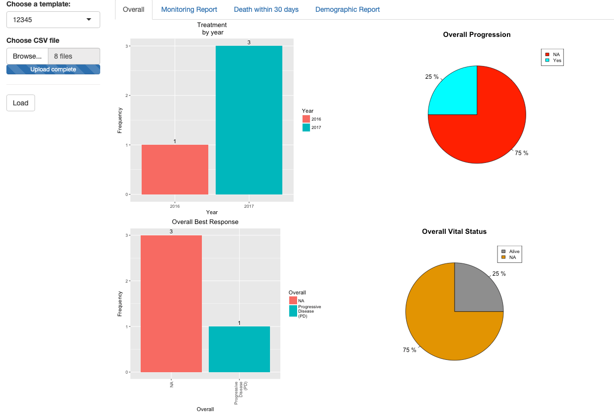
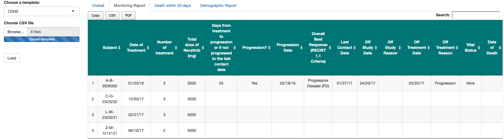
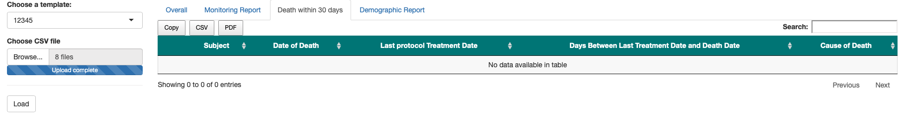
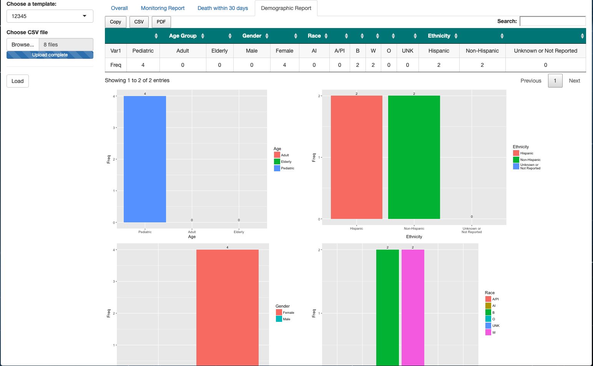

# Sample shiny app to monitor a portfolio of clinical trials

This repository includes an example of a shiny app that monitors a typical clinical tria based on the user defined metrics.

**Overview of the app:**
  1. Choose the template desired of a protocol (user can build the template in a program)
  2. Upload the .CSV files (it can be modified to access a database-more in the future)
  3. Load the report (the program automatically extract the variable needed for the generation of the report)
       - Overall tab: Overall graphs of treatment per year, progression, best response, and vital status.
       - Monitor tab: It contains important metrics for a simple clinical trial.
       - Death within 30 days tab: It contains metrics about the death of a patient in a trial.
       - Demographic tab: It contains metrics about the demographic of patients in a trial along with respective graphs (for easy viewing)
  4. Download csv/pdf/copy files of the page you are viewing.

**Description of dataset:**
  1. aelogyn.CSV: It contains information about whether a patient experience adverse event or not.
  2. demo.CSV: It contains information about the demographic of patients.
  3. fu.CSV: It contains follow up information about patients.
  4. offstudy.CSV: It contains information about patients who are drop from a study.
  5. onstudy.CSV: It contains information about enrollment of patients into a study.
  6. subj.CSV: It contains information about patients in a study.
  
**Sample screenshotd:**

### Overall

  
### Monitor

### Death

### Demographic

  
Demo [dataset](https://github.com/kennchin/shiny_app_monitor/tree/master/data) is provided for testing purposes in the data folder in this repository. 

Note: Some functionality works better in the browser than Rstudio.
    

